# Active Directory Home Lab

This project presents a simple Active Directory lab environment built using virtual machines.  
The lab simulates a small company infrastructure with centralized user management, file sharing and Group Policy configuration.

---

## Environment

Virtualization platform: VirtualBox

### Server

- DC1 - Windows Server 2022  
  Roles:
  - Active Directory Domain Services
  - DNS Server
  - File Server

### Client

- DESKTOP01 - Windows 11  
  Domain-joined workstation

### Domain

- company.com

---

## Final Configuration

### Active Directory

Organizational Units:

- HR
- IT
- Sales
- Groups

Users:

- anna.nowak (HR)
- michal.kowalczyk (IT)
- jan.kowalski (Sales)

Security Groups:

- HR_Users
- IT_Users
- Sales_Users

Users are assigned to groups based on department.

---

### File Shares

Shared path:
\\DC1\Shares

Folders:

- HR
- IT
- Sales
- Public

---

### Permissions

Access is controlled using security groups:

- HR -> HR_Users
- IT -> IT_Users
- Sales -> Sales_Users
- Public -> Domain Users

Each department has access only to its own folder.

---

### Group Policy

Configured GPOs:

1. Drive mapping  
   H: -> \\DC1\Shares\HR

2. Control Panel restriction  
   Prevents users from accessing system settings

---

### Verification

- users can access only their department folder
- all users can access Public folder
- access to other folders is denied
- network drive is mapped automatically
- Control Panel is blocked

---

## Implementation Steps

Click to expand full configuration process

### 1. Active Directory setup

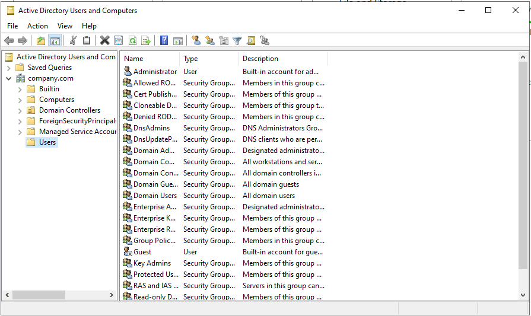

_Active Directory Users and Computers console with domain structure._

---

### 2. Organizational Units

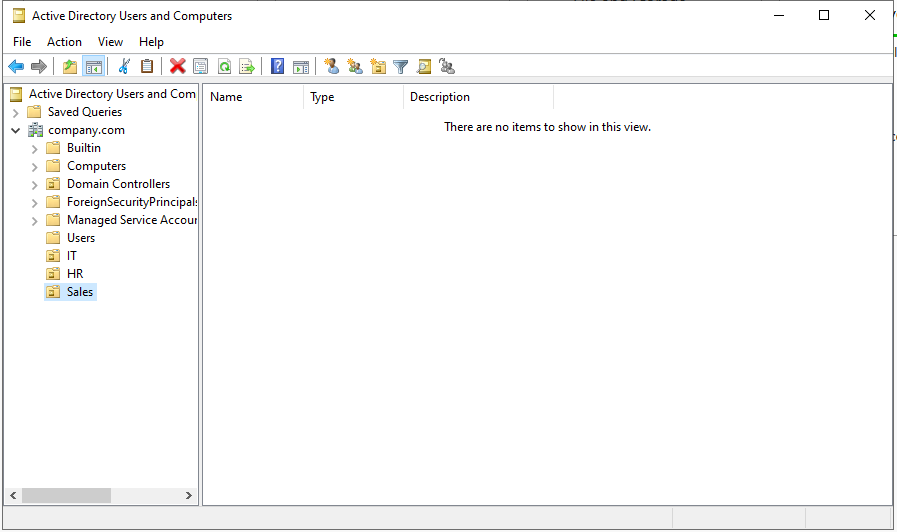

_Creation of Organizational Units for HR, IT and Sales._

---

### 3. Users

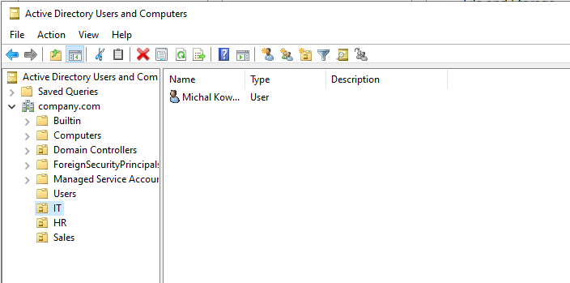

_Creation of domain users in respective departments. In this example Michal Kowalczyk is user of IT department._

---

### 4. Security Groups

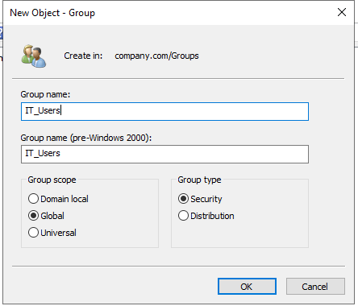

_Creation of security groups for each department._

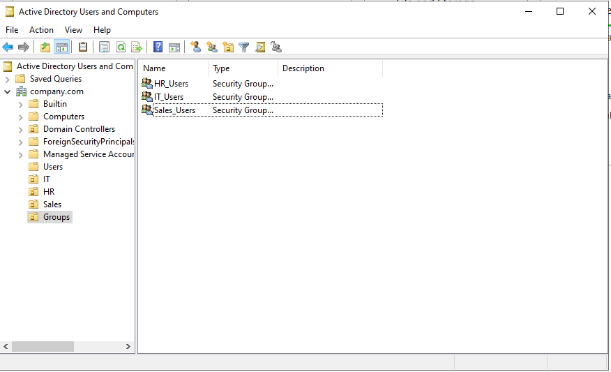

_All security groups._

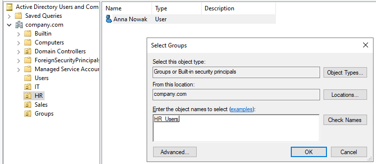

_Assigning users to appropriate security groups. In this example, Anna Nowak is being assigned to HR Users group._

---

### 5. DNS Configuration

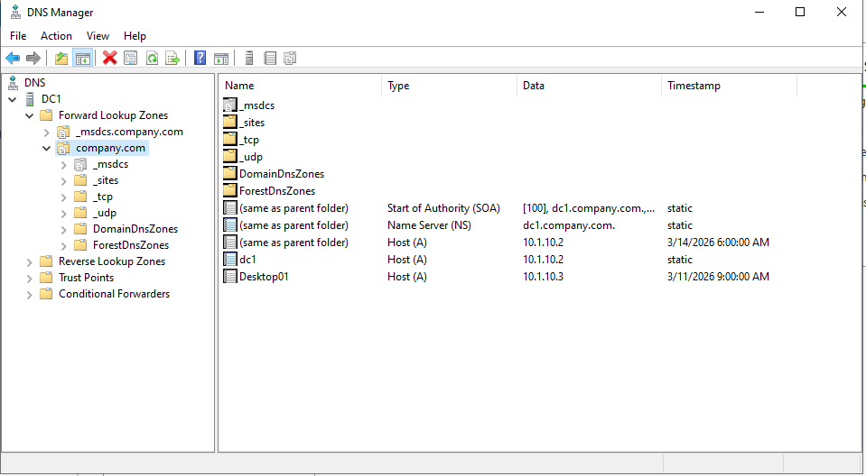

_DNS zone configured for domain name resolution._

---

### 6. Client joined to domain

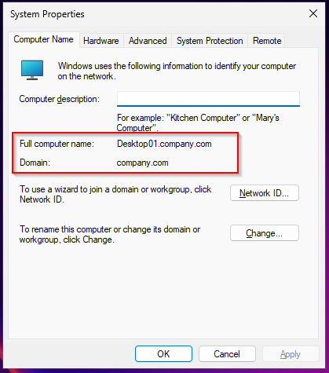

_Client machine successfully joined to the domain._

---

### 7. File Shares

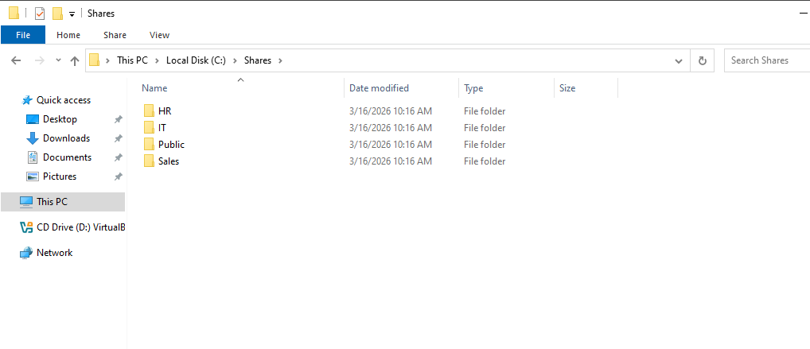

_Creation of shared folders for departments._

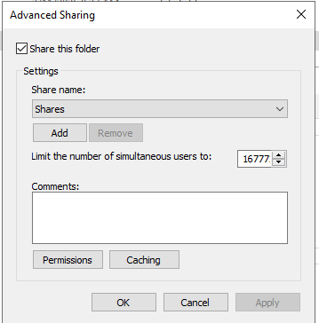

_Shares folder published in the network._

---

### 8. NTFS Permissions

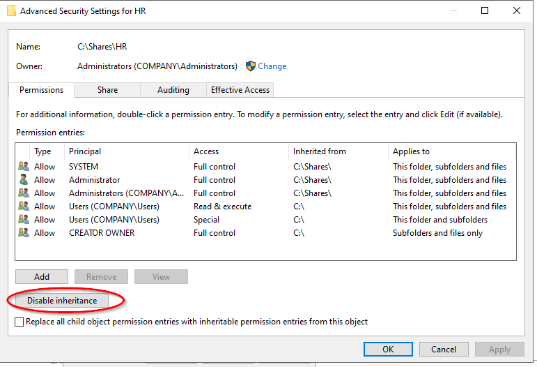

_Disabling inheritance to configure custom permissions._

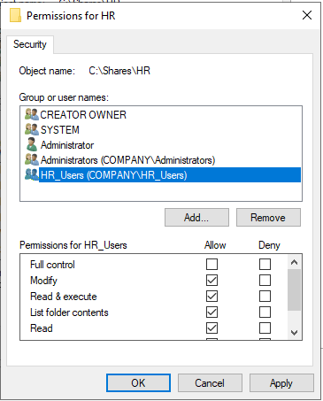

_Permissions assigned to HR group._

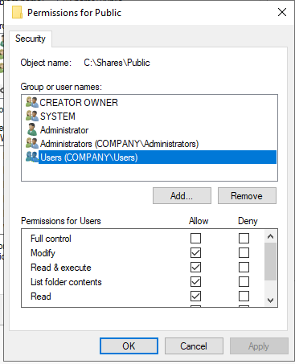

_Public folder accessible to all domain users._

---

### 9. Group Policy ? Drive Mapping

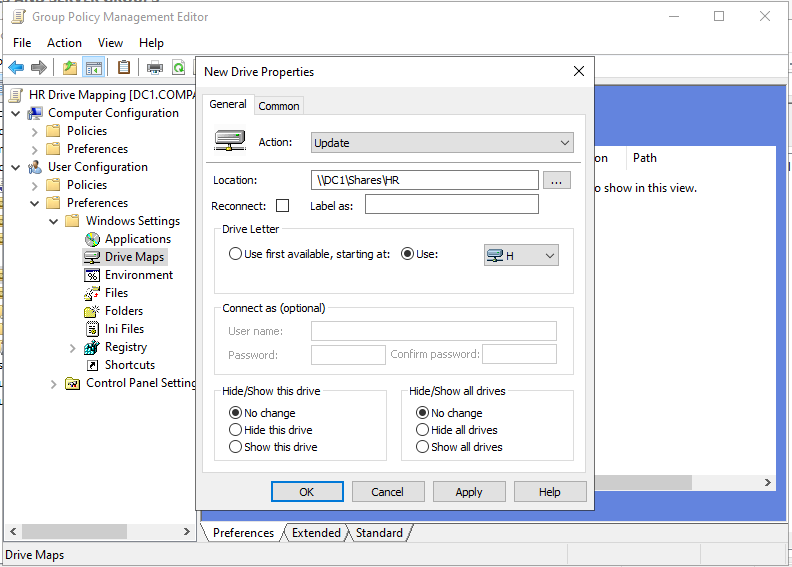

_GPO mapping network drive H: to department share._

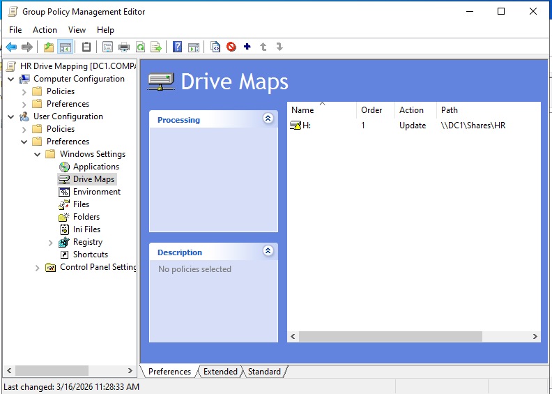

_Drive mapping GPO configured._

---

### 10. Group Policy ? Control Panel restriction

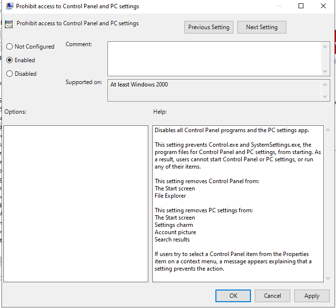

_GPO restricting access to Control Panel._

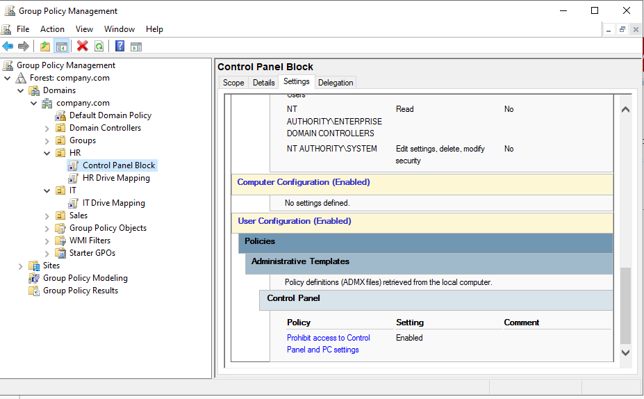

_Control Panel GPO configured._

---

### 11. Verification

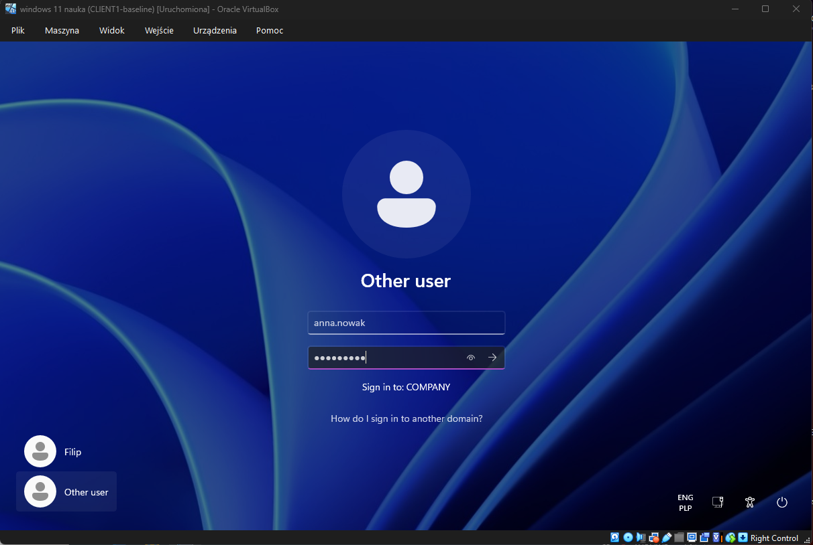

_Logging in as an HR user._

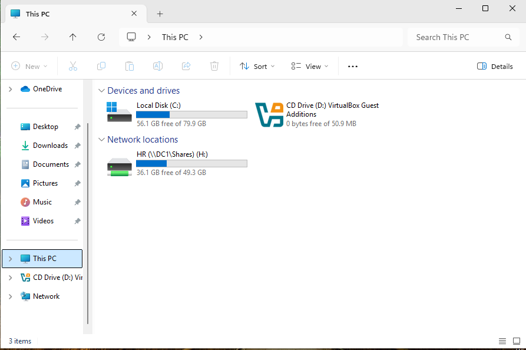

_Network drive automatically mapped after login._

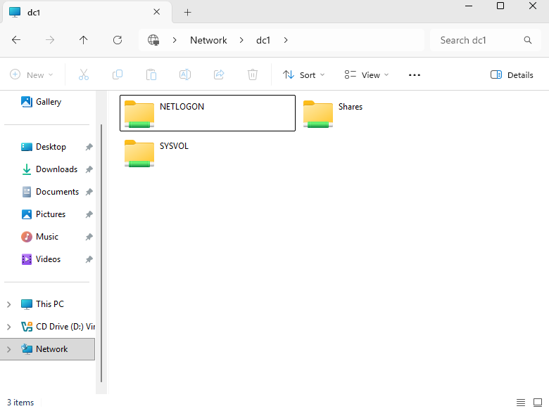

_Shared folders seen by an HR user._

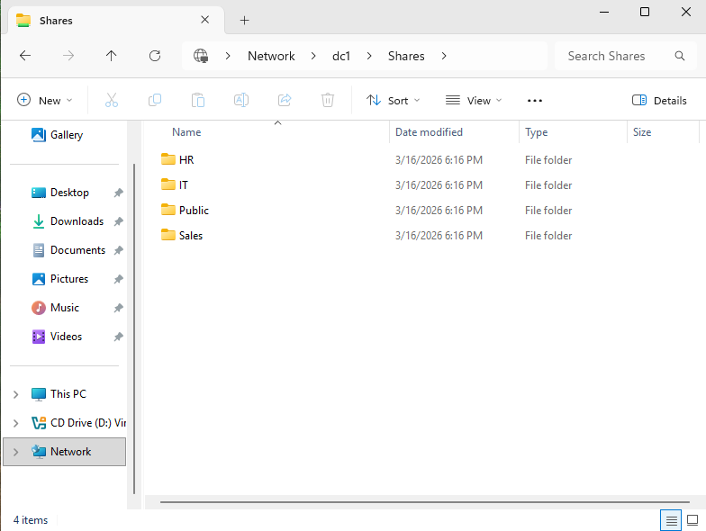

_Subfolders of "Shares" folder seen by an HR user._

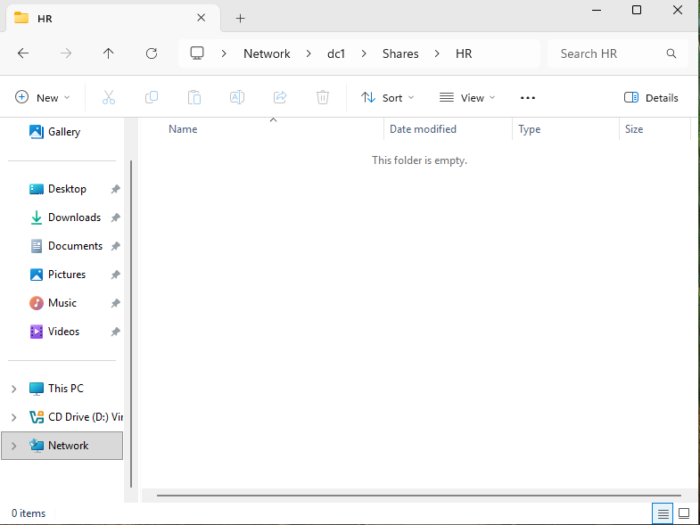

_Succesfully opened folder for the HR department._

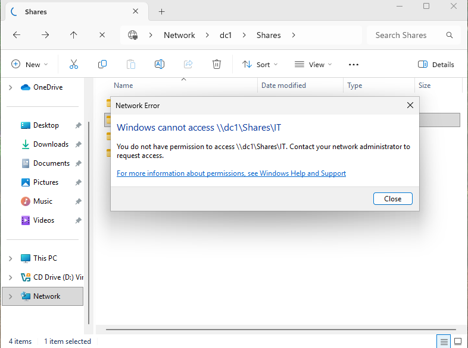

_User denied access to unauthorized folder._

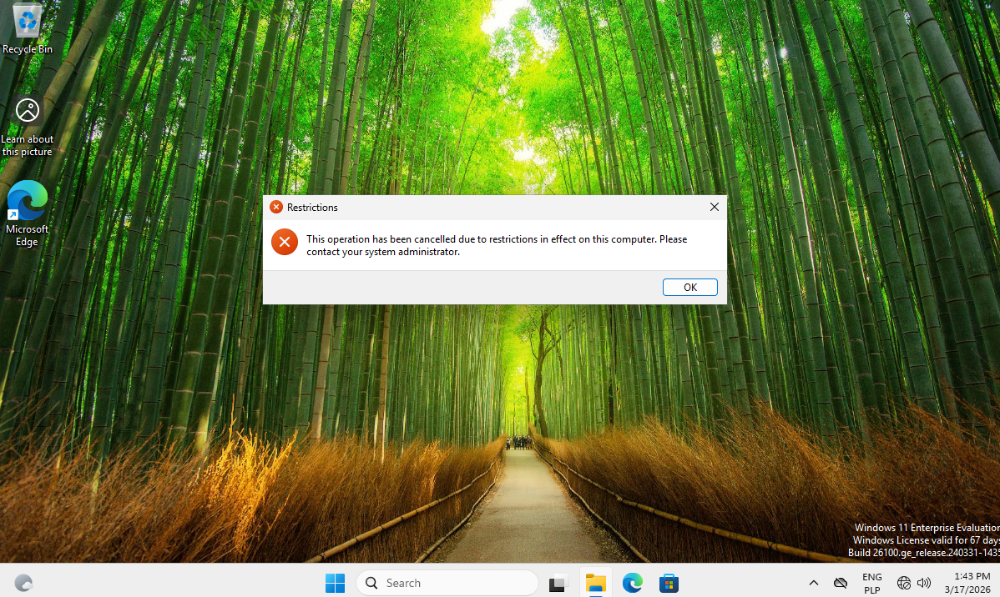

_User denied access to control panel._

## Summary

This lab demonstrates:

- Active Directory configuration
- user and group management
- NTFS permissions
- SMB file sharing
- Group Policy management
